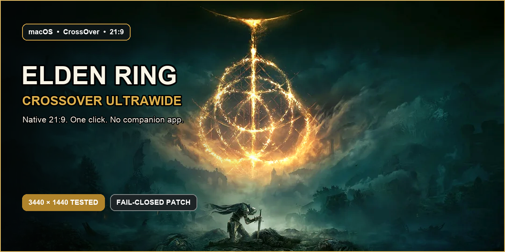
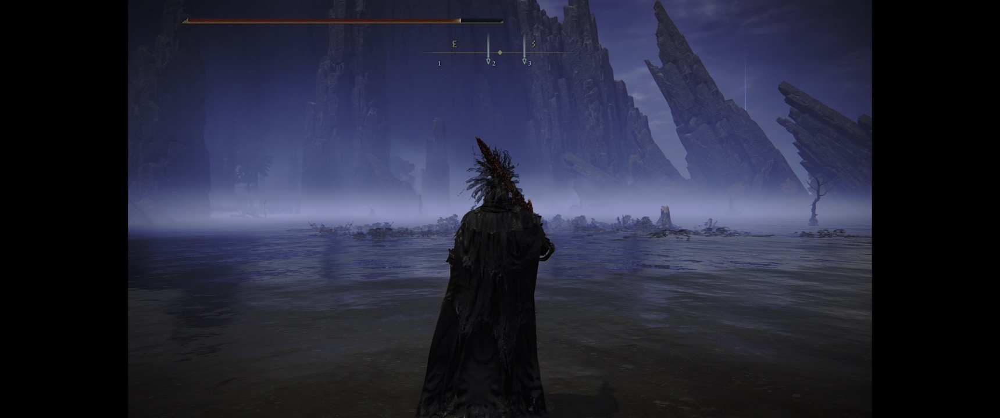
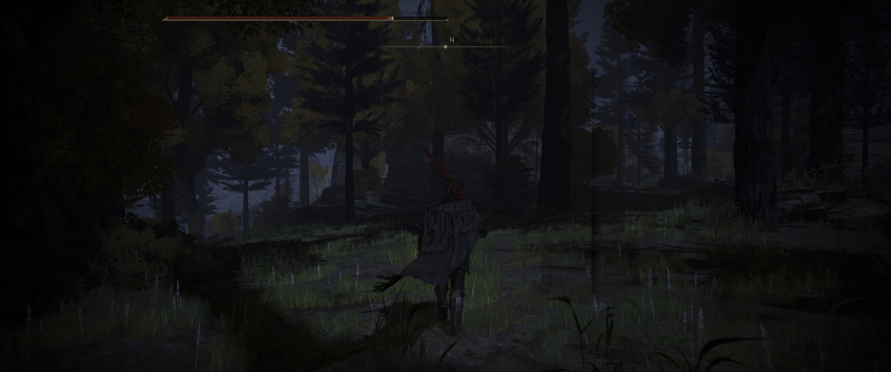

<p align="center">
  
</p>

<h1 align="center">Elden Ring CrossOver Ultrawide</h1>

<p align="center">
  <strong>Remove Elden Ring's 16:9 black bars on an ultrawide Mac—then launch normally from CrossOver.</strong>
</p>

<p align="center">
  <a href="https://github.com/IgnazioDS/elden-ring-crossover-ultrawide/releases/latest"></a>
  <a href="https://github.com/IgnazioDS/elden-ring-crossover-ultrawide/actions/workflows/build.yml"></a>
  <a href="LICENSE"></a>
  <a href="https://github.com/IgnazioDS/elden-ring-crossover-ultrawide/stargazers"></a>
</p>

This open-source Elden Ring ultrawide fix targets the Windows Steam version
running through [CrossOver](https://www.codeweavers.com/crossover) on macOS.
It removes the 16:9 pillarboxing at 21:9 resolutions such as **3440×1440**
without keeping Flawless Widescreen or another companion application running.

The banner uses the Elden Ring image supplied by the repository owner. It is
not AI-generated; only crop, tonal adjustment and typography were applied.

The installed Steam executable is never modified. The launcher validates a
known-safe signature, patches a temporary copy, starts the game, and removes
that copy when you quit.

> [!WARNING]
> **Offline only.** This route bypasses Easy Anti-Cheat, so Elden Ring online
> multiplayer is unavailable. Never use the temporary executable with EAC or
> attempt online play.

## Before and after

| Vanilla 16:9 pillarboxing on a 21:9 display | Native 3440×1440 ultrawide |
|:--:|:--:|
|  |  |

Both images are real CrossOver captures from the tested setup—no mockups.

## Why this fix is different

| Capability | This launcher |
|---|---|
| Normal CrossOver game icon | ✅ One click after installation |
| Companion app running in the background | ✅ None |
| Installed `eldenring.exe` modified | ✅ Never |
| Unknown game build handling | ✅ Fails closed before patching |
| Temporary-file cleanup | ✅ Automatic on exit |
| Steam Cloud, playtime and achievements | ✅ Preserved |
| Rollback | ✅ Original URL/menu records backed up |
| Online multiplayer | ❌ EAC is bypassed; offline only |

## 30-second install

### Requirements

- A legitimate Steam copy of Elden Ring installed inside a CrossOver bottle
- Elden Ring **1.17.1** with a clean Steam executable
- CrossOver 26.x on macOS; tested on Apple silicon
- The game fully closed during installation

### Terminal

```sh
git clone https://github.com/IgnazioDS/elden-ring-crossover-ultrawide.git
cd elden-ring-crossover-ultrawide
chmod +x scripts/*.command scripts/*.sh
./scripts/install.command
```

The installer discovers standard CrossOver bottles—including bottles on an
external volume—verifies checksums, creates a rollback backup, and rewires the
existing Elden Ring shortcut. Set your native ultrawide resolution in-game,
then launch from the **normal CrossOver Elden Ring icon**.

For a custom or ambiguous installation:

```sh
./scripts/install.command --bottle "/full/path/to/Elden Ring bottle"
```

No Python runtime, ModEngine, Flawless Widescreen, or special launch order is
required.

## Supported build

| Component | Verified value |
|---|---|
| Elden Ring | Steam build 1.17.1 |
| Clean `eldenring.exe` SHA-256 | `1a3547101327f65d0c76da2f9190ac0aa66871ea42bae2aecc61e11a8b597891` |
| CrossOver | 26.3 |
| macOS hardware | Apple silicon, tested on M2 Pro |
| Display | 3440×1440 at 21:9 |

An unknown or modified executable is rejected without being changed. Game
updates can move the patch location, so a future build may require a new
reviewed compatibility profile.

## How the safe launch works

```text
Normal CrossOver icon
        ↓
Private bottle-local URL protocol
        ↓
Validate clean 1.17.1 byte signature
        ↓
Copy → patch one branch byte → launch temporary executable
        ↓
Wait for exit → delete temporary and staging files
```

The launcher validates six bytes at offset `0x19ED05E`, copies the clean game,
and changes only the branch byte from `74` to `EB` in the temporary copy. A
named Windows mutex prevents concurrent patch sessions. Failures are logged
and leave the installed Steam file untouched.

## Steam saves, Cloud and achievements

The game remains associated with Steam AppID `1245620`, so local saves, Steam
Cloud, playtime, overlay and achievements continue to operate. Steam must be
running and signed in inside the bottle. The launcher never reads credentials
or touches save files.

## Diagnose or uninstall

```sh
./scripts/diagnose.command
./scripts/uninstall.command
```

Both commands accept the optional `--bottle` argument. Uninstall restores the
original records from `drive_c/EldenRingTools/backups` and removes the private
URL protocol. The launcher log is located at:

```text
C:\EldenRingTools\elden-ring-ultrawide.log
```

## Frequently asked questions

<details>
<summary><strong>Does this fix Elden Ring black bars at 3440×1440?</strong></summary>

Yes. Native 3440×1440 edge-to-edge gameplay was cold-launch tested from the
normal CrossOver icon. Other 21:9 resolutions should benefit from the same
black-bar branch patch, but only the configuration above is currently verified.
</details>

<details>
<summary><strong>Must Flawless Widescreen stay open?</strong></summary>

No. Flawless Widescreen is not installed or launched by this project. The
bottle-local helper exits after Elden Ring closes.
</details>

<details>
<summary><strong>Can I play Elden Ring online with this?</strong></summary>

No. The workaround launches without Easy Anti-Cheat and is strictly for
offline play. Use an unmodified EAC launch path for online multiplayer.
</details>

<details>
<summary><strong>Will a Steam update break my installed game?</strong></summary>

No installed game file is patched. If the expected signature changes, the
launcher stops and logs an error. Open a compatibility report with the new
clean executable hash—never upload the executable.
</details>

<details>
<summary><strong>Does it work on M1, M3, M4 or Intel Macs?</strong></summary>

The design is architecture-independent, but the current verified machine is an
M2 Pro Mac. Reports from other Macs and CrossOver versions are welcome.
</details>

## Build and verify

The dependency-free launcher source is in
[`src/EldenRingUltrawideLauncher.cs`](src/EldenRingUltrawideLauncher.cs).
GitHub Actions builds it on Windows and ShellChecks every installer script.
The tested 8.7 KB binary in `dist/` has SHA-256:

```text
1506f0c7d661915bf859b1694364d56c825775d7c229f8b6b982f38cc3527543
```

## Help the project grow

- ⭐ **Star the repository** if it solved your ultrawide problem; stars help
  other Mac players find a tested solution.
- Share a verified configuration in
  [Discussions](https://github.com/IgnazioDS/elden-ring-crossover-ultrawide/discussions).
- Report new game builds through the
  [compatibility form](https://github.com/IgnazioDS/elden-ring-crossover-ultrawide/issues/new?template=bug_report.yml).
- See [CONTRIBUTING.md](CONTRIBUTING.md) for safe patch-profile requirements.
- Use the ready-made, factual copy in [docs/SHARING.md](docs/SHARING.md) when
  sharing with a community whose rules permit it.

## Privacy, copyright and trademarks

No FromSoftware/Bandai Namco binaries or extracted assets, credentials, saves,
or CrossOver bottle data are distributed. Users must own Elden Ring and
provide their own legitimate Steam installation. The two user-captured
gameplay screenshots above are included solely to demonstrate compatibility
and aspect-ratio behavior.

Elden Ring is a trademark of its respective owners. CrossOver is a trademark
of CodeWeavers. This independent community project is not affiliated with or
endorsed by FromSoftware, Bandai Namco, Valve, or CodeWeavers.

Released under the [MIT License](LICENSE).
